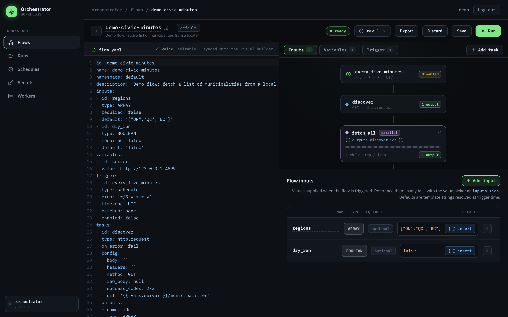
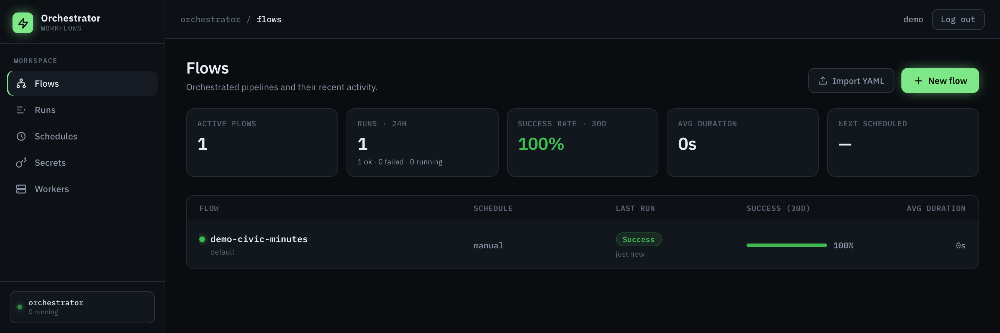
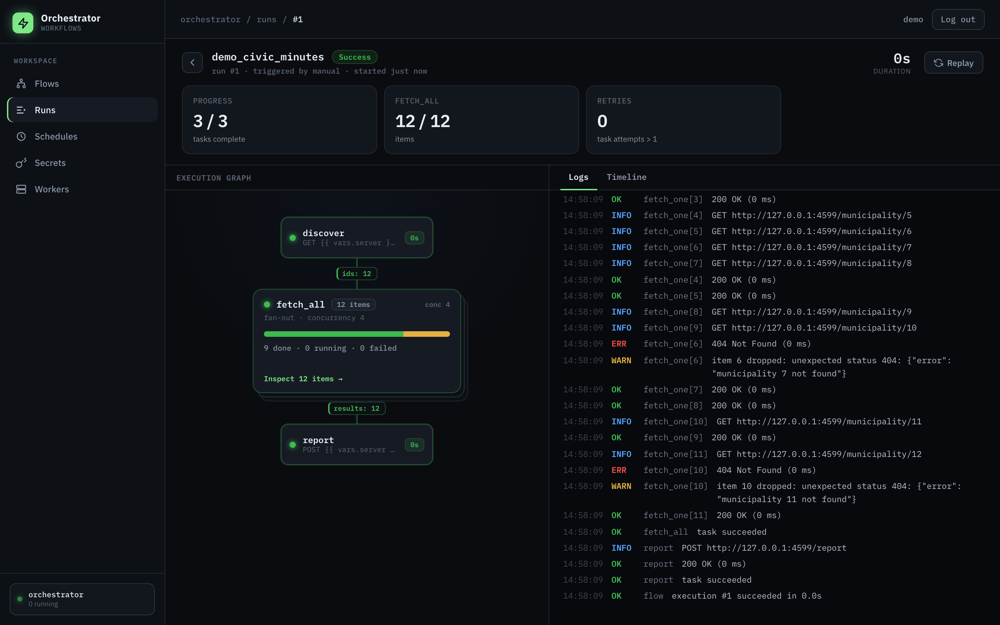

# Orchestrator

[](LICENSE)

Orchestrator is a single-binary workflow orchestration tool. Flows are ordered
lists of tasks — HTTP requests in v1, extensible via a Rust plugin trait —
with typed inputs, variables, cron triggers, parallel fan-out, retries, and
full run observability. One Rust binary serves the web UI, JSON API,
scheduler, and executor; state lives in a single SQLite file.



<p align="center"><em>Edit a flow as YAML or in the visual builder — both round-trip, live.</em></p>

## Features

- Flows defined as YAML or in the visual builder (both round-trip)
- HTTP request tasks (v1), more task types via plugins
- Parallel fan-out over arrays with a live per-item inspector
- Cron schedules with timezone support and catch-up policies
- Every save is a revision; restore any revision
- Encrypted secrets (ChaCha20-Poly1305, key on disk, values redacted from logs and results)
- Single-binary deploy — the UI is one embedded HTML file
- Live run view via SSE: statuses, fan-out counters, and logs stream in
- Bring your own worker (BYOW): route flows to remote workers by queue, keeping
  the server as control plane while execution runs on your own machines

## Contents

- [Quickstart](#quickstart)
- [Flow YAML reference](#flow-yaml-reference)
- [Writing a plugin](#writing-a-plugin)
- [Configuration](#configuration)
- [Bring your own worker (BYOW)](#bring-your-own-worker-byow)
- [Security notes](#security-notes)
- [Development](#development)
- [Known limitations (v1)](#known-limitations-v1)
- [License](#license)

## Quickstart

Requires Rust (see `rust-toolchain.toml`) and Node.js.

```sh
# Build the UI (one self-contained index.html), then the binary
cd ui && npm install && npm run build && cd ..
cargo build --release

# Run
./target/release/orchestrator serve
```

Open http://127.0.0.1:4400 to reach the workspace — flows, their schedules,
and recent activity at a glance.



For a guided tour, run the demo (requires `python3` and `curl`; starts a local
mock API, imports `examples/demo-flow.yaml`, triggers a run, and follows it).
The server must already be running (`./target/release/orchestrator serve`, as
above) — the script waits briefly for it at `ORCH_URL` (default
`http://127.0.0.1:4400`) and exits if it never comes up:

```sh
./scripts/demo.sh
```

The demo flow fans out over a list of municipalities — a few ids 404 and are
dropped mid-run — then POSTs an aggregate report. Open the run to watch the
execution graph, fan-out counters, and logs stream in live:



## Flow YAML reference

A flow document is the flow `id` plus the definition. Export via
`GET /api/flows/:id/export`, import via `POST /api/flows/import` (the YAML is
the request body). `examples/demo-flow.yaml` is a complete example.

```yaml
id: my_flow            # [a-z][a-z0-9_]*, max 64 chars
name: my-flow          # display name
namespace: default     # optional grouping label
description: ""
inputs: []
variables: []
triggers: []
tasks: []
```

### Inputs

Run parameters, referenced as `{{ inputs.<id> }}`.

```yaml
inputs:
- id: regions
  type: ARRAY          # STRING | ARRAY | DATE | INT | BOOLEAN | JSON
  required: false
  default: '["ON","QC"]'
```

`default` is a template string rendered at trigger time; `ARRAY`/`JSON`
defaults are JSON text. Values supplied via the API are typed JSON values and
are checked against the declared type.

### Variables

Flow-scoped string literals, referenced as `{{ vars.<id> }}`:

```yaml
variables:
- id: server
  value: https://api.example.com
```

### Triggers

Schedule triggers (`type: schedule` is the only kind in v1):

```yaml
triggers:
- id: nightly
  type: schedule
  cron: 0 3 * * *          # 5-field cron (no seconds/years)
  timezone: America/Toronto # IANA name, default UTC
  catchup: latest           # none | latest | all, default latest
  enabled: true             # default true
```

**Catch-up semantics.** While the process is up, every policy fires each
occurrence as it comes due: the newest due occurrence counts as a *live* fire
when it came due within the last 10 seconds, and live fires launch under
every policy. Occurrences older than that are *backlog* (e.g. missed during
downtime), governed by `catchup`:

- `none` — skip backlog entirely; wait for the next future occurrence.
- `latest` — fire the newest due occurrence exactly once (the single make-up
  run after downtime).
- `all` — fire every missed occurrence, oldest first, capped at the most
  recent 100 (a WARN is logged when the cap trims the backlog).

Disabling a schedule (or pausing a flow) never causes a catch-up burst:
re-enabling resumes at the next future occurrence.

### Tasks

Tasks run sequentially in definition order. Every task has an `id`
(`[a-z][a-z0-9_]*`, unique across the flow including parallel children) and a
`type`. Generic concerns live in the task envelope, outside the plugin
config:

```yaml
- id: scrape
  type: http.request                  # plugin type_id, or "parallel"
  retry:                              # optional; absent = single attempt
    type: exponential                 # only kind in v1
    max_attempts: 5                   # 1..=20, includes the first attempt
    base_seconds: 30                  # 1..=3600; attempt n sleeps base * 2^(n-1)
  timeout_seconds: 60                 # per attempt, 1..=3600 (default 60)
  on_error: fail                      # fail (default) | continue
  config: { ... }                     # plugin-owned, see below
  outputs:
  - name: documents                   # referenced as {{ outputs.scrape.documents }}
    type: ARRAY
    extract: result.body.documents    # dotted path rooted at `result`
```

`on_error: continue` records the failure and keeps the run going; inside a
parallel task it drops the failed item instead of failing the whole task.
Output `extract` paths support array indices (`result.body.data[0].id`);
extraction failure fails the task.

**`http.request` config** (result is `{status, headers, body}`; `body` is
parsed JSON when possible, else a string):

| field           | value                                                        |
|-----------------|--------------------------------------------------------------|
| `method`        | `GET` (default), `POST`, `PUT`, `PATCH`, `DELETE`            |
| `url`           | template string, required                                    |
| `headers`       | `[{key, value}]`; values support templates                   |
| `body`          | `[{key, value}]`, sent as a JSON object; ignored if `raw_body` set |
| `raw_body`      | raw request body string; overrides `body`                    |
| `success_codes` | comma list of codes/classes, e.g. `2xx,301` (default `2xx`)  |

Redirects are not followed (match 3xx explicitly via `success_codes`).
Non-success status fails the attempt; 5xx and network errors are retryable
per the retry policy, 4xx is terminal.

**`parallel`** is a core task type (not a plugin): it renders `items` to an
array and runs the child chain once per item.

```yaml
- id: fetch_all
  type: parallel
  items: '{{ outputs.discover.ids }}'  # must render to an array
  concurrency: 4                       # 1..=256 items in flight
  tasks:                               # child chain, plugin tasks only
  - id: fetch_one
    type: http.request
    on_error: continue                 # failed item is dropped, run continues
    config:
      method: GET
      url: '{{ vars.server }}/item/{{ taskrun.value }}'
    outputs: []
  outputs:
  - name: results
    type: ARRAY
    extract: result.items              # per-item final child results, in order;
                                       # dropped items are null
```

Children reference the current item as `{{ taskrun.value }}` (with optional
paths, e.g. `{{ taskrun.value.id }}`) plus prior child outputs.

### Expressions

Template strings mix literal text with `{{ … }}` references:

- `{{ inputs.<id> }}` · `{{ vars.<id> }}` · `{{ secrets.<NAME> }}` ·
  `{{ outputs.<task>.<name> }}` · `{{ taskrun.value }}` (parallel children)
- Paths support `.field` and `[n]` segments: `{{ outputs.t.rows[0].id }}`
- `{{ now() }}` — current time; filter
  `| dateAdd(<n>, 'DAYS'|'HOURS'|'MINUTES')`, e.g.
  `{{ now() | dateAdd(-7, 'DAYS') }}`

**Type preservation:** a value that is exactly one `{{ ref }}` resolves to
the referenced JSON value — arrays stay arrays, numbers stay numbers. Mixed
templates (`"id-{{ inputs.n }}"`) stringify.

### Secrets

Store secrets in the UI (or `PUT /api/secrets/:name`) and reference them as
`{{ secrets.NAME }}`. Values are encrypted at rest (ChaCha20-Poly1305) with a
master key auto-generated at `~/.orchestrator/master.key` (0600) on first
run. Secrets resolve at execution time only and are redacted (`***`) from
logs and stored task results.

The UI and API manage the **server's** store, which serves `local`-queue runs
(those the server executes itself). Runs on a worker queue resolve secrets
against the **worker's own** store instead — populate that from the CLI on the
worker box (see [BYOW](#bring-your-own-worker-byow)). `orchestrator secrets`
also works against the server's store when it isn't running:

```sh
# Defaults to the worker store (~/.orchestrator/worker.{db,key}).
orchestrator secrets set API_TOKEN                 # prompts via stdin (no shell history)
echo -n "$TOKEN" | orchestrator secrets set API_TOKEN
orchestrator secrets list
orchestrator secrets delete API_TOKEN

# Point at another store, e.g. the server's while it's stopped:
orchestrator secrets --db ~/.orchestrator/orchestrator.db \
                     --key ~/.orchestrator/master.key list
```

## Writing a plugin

A task type is a plugin: one Rust module contributing both execution code and
a declarative UI manifest. The frontend renders every task inspector from the
manifests served at `/api/plugins`, so a new task type needs zero frontend
changes.

1. Add a module under `src/plugins/` and implement `TaskPlugin`
   (`src/plugins/mod.rs`):

```rust
use crate::plugins::{FieldSpec, PluginManifest, TaskContext, TaskError, TaskPlugin, Widget};

pub struct EchoPlugin;

#[async_trait::async_trait]
impl TaskPlugin for EchoPlugin {
    fn manifest(&self) -> PluginManifest {
        PluginManifest {
            type_id: "echo".into(),
            label: "Echo".into(),
            description: "Return the configured message".into(),
            icon: "box".into(),
            color: "#7ee787".into(),
            fields: vec![FieldSpec {
                key: "message".into(),
                label: "Message".into(),
                widget: Widget::Template,   // gets the expression picker for free
                required: true,
                default: serde_json::Value::Null,
                help: "supports {{ }} templates".into(),
                options: None,
                min: None,
                max: None,
                template: true,
            }],
        }
    }

    fn validate(&self, config: &serde_json::Value) -> Vec<String> {
        // Config as authored — {{ }} expressions still unrendered.
        match config.get("message") {
            Some(serde_json::Value::String(s)) if !s.is_empty() => vec![],
            _ => vec!["message is required".into()],
        }
    }

    async fn execute(
        &self,
        ctx: &TaskContext,
        config: serde_json::Value, // fully rendered; templates keep JSON types
    ) -> Result<serde_json::Value, TaskError> {
        ctx.info("echoing");
        Ok(serde_json::json!({ "message": config["message"] }))
    }
}
```

2. Register it in `PluginRegistry::builtin` (`src/plugins/mod.rs`):

```rust
registry.register(Arc::new(echo::EchoPlugin));
```

That's it — the UI renders your manifest automatically: task palette entry,
inspector fields (widget vocabulary: `select`, `template`, `keyvalue`,
`number`, `duration`, `toggle`, `text`, `code`), YAML round-trip, validation
plumbing, and run views all come for free.

Execution contract: log through `ctx.info/ok/warn/err/dbg` (lines stream into
the run view), honor `ctx.cancel` promptly, and don't implement your own
retries or timeouts — the engine owns both. Return `TaskError::retryable`
for transient failures and `TaskError::fatal` for definitive ones; declared
task `outputs` extract from the JSON you return (paths rooted at `result`).

## Configuration

```
orchestrator serve [--listen ADDR] [--db PATH] [--key PATH] [--worker-token TOKEN]
```

| flag             | default                           |
|------------------|-----------------------------------|
| `--listen`       | `127.0.0.1:4400`                  |
| `--db`           | `~/.orchestrator/orchestrator.db` |
| `--key`          | `~/.orchestrator/master.key`      |
| `--worker-token` | none (worker API disabled; repeatable, or `ORCH_WORKER_TOKENS`) |

`~/.orchestrator` is created with 0700 permissions if missing. Server log
verbosity is controlled with the standard `RUST_LOG` env var (default
`info`), e.g. `RUST_LOG=debug orchestrator serve`.

## Bring your own worker (BYOW)

By default the server executes flows itself. To run execution on your own
machines instead (a GPU box, a host with private-network access, …), give a
flow a `queue` and connect a worker that serves it. The server stays the
control plane — UI, scheduler, and the single source of truth — while the
worker runs the same engine locally against **its own** secret store; plaintext
secrets never leave the worker.

```yaml
id: transcribe
name: transcribe
queue: gpu          # runs on a worker serving `gpu`; omit for `local` (the server)
tasks: [ ... ]
```

Enable the worker API on the server by granting one or more bearer tokens, then
run a worker anywhere that can dial the server:

```sh
# Server: accept a worker token (repeatable, or ORCH_WORKER_TOKENS=a,b,c)
orchestrator serve --worker-token s3cret

# Worker (on the GPU box): claim `gpu` runs and execute them locally
orchestrator worker --server http://server:4400 --token s3cret --queues gpu
```

Because a worker resolves `{{ secrets.NAME }}` against its **own** store,
populate that store on the worker box before running flows that need secrets —
the server never ships them over. Use `orchestrator secrets` (it defaults to
the worker store, `~/.orchestrator/worker.{db,key}`):

```sh
# On the GPU box, before/while the worker runs:
echo -n "$HF_TOKEN" | orchestrator secrets set HF_TOKEN
orchestrator secrets list
```

The worker pulls queued `gpu` runs, executes them, and streams status, results,
and logs back — the live run view works identically whether a run executes on
the server or a worker. Runs on unserved queues wait, visibly `queued`, until a
matching worker connects. If a worker disappears mid-run, its lease lapses and
the server marks the run failed. Workers dial out (pull-based), so they need no
inbound reachability and work fine behind NAT. See
`docs/plans/2026-07-06-byow-workers-design.md` for the full design.

`orchestrator worker` flags: `--server`, `--token` (or `ORCH_WORKER_TOKEN`),
`--id`, `--queues` (comma-separated, default `default`), `--capacity`, `--db`
(scratch), `--key` (the worker's own secrets key). Populate that key's store
with `orchestrator secrets set NAME` (and `list` / `delete`) — it targets
`--db`/`--key`, defaulting to the same worker paths.

## Security notes

- **No authentication.** Orchestrator binds `127.0.0.1` by default. Passing
  `--listen` with a non-loopback address exposes the full UI and API —
  including secrets management and arbitrary outbound HTTP — **without any
  auth**. Only expose it behind a reverse proxy that adds authentication, or
  on a trusted network.
- Secret values are encrypted at rest and redacted from logs and stored task
  results, and the API never returns them (`GET /api/secrets` lists names and
  timestamps only). Protect `master.key` — with it, the database's secrets
  are decryptable.

## Development

The fastest loop uses [mise](https://mise.jdx.dev), which provisions the
toolchain (Rust, Node, `watchexec`) and runs both dev servers:

```sh
mise run dev        # UI hot-reload + backend auto-restart
```

Then open **http://localhost:5173**. The Vite dev server hot-reloads the UI in
place on every edit and proxies `/api` to the backend on `:4400`. The backend
is compiled, so Rust edits trigger an incremental recompile and a server
restart (a few seconds) — the closest thing to HMR a compiled backend can do.
Dev state (DB + key) lives in `./.dev`, never `~/.orchestrator`. Run the halves
separately with `mise run dev-ui` / `mise run dev-api` if you prefer two
terminals.

Without mise, run the pieces yourself:

```sh
cargo run -- serve                       # backend on :4400 (restart manually on change)
cd ui && npm run dev                     # UI dev server; proxies /api to :4400
cargo test                               # Rust tests (unit + integration)
cd ui && npm test                        # UI tests (vitest)
```

Debug builds (`cargo run -- serve`) read `ui/build/index.html` from disk on
every request, so you can rebuild the UI without recompiling Rust. Release
builds embed the file at compile time — `ui/build/index.html` must exist when
compiling with `--release`.

## Known limitations (v1)

- Plugin config validation returns flat messages, so errors anchor at
  `tasks[i].config` rather than the exact field (plugins prefix messages with
  the field name as a convention).
- YAML import: duplicate mapping keys are last-wins, not rejected.
- The HTTP plugin buffers response bodies fully (no size cap), and
  multi-value response headers are comma-joined (lossy for `Set-Cookie`).
- No auth, no multi-user (see Security notes).
- Single process, single node: the scheduler and executor run in-process;
  runs active during an unclean shutdown are marked failed ("interrupted") on
  the next startup.

## License

MIT — see [LICENSE](LICENSE).
